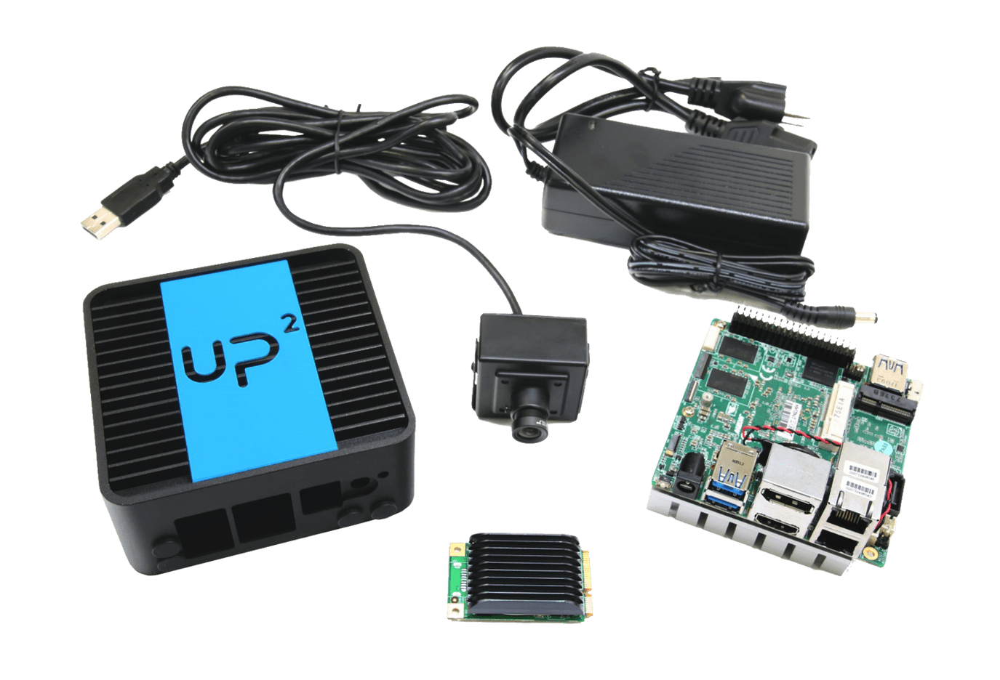

# Hello, Seattle!

# Intel Industrial IoT Workshop Setup Guide
Welcome to the Intel Industrial IoT Workshop. In this workshop, we will explore Industry 4.0 technologies through lectures and hands on labs. By the end of the workshop, you should have a solid understanding of different Industry 4.0 technologies and have some working ideas of how to implement them in your place of business.

Today you will learn about:
- Intel’s Industrial IoT Strategy
- The Aaeon UP Squared Board and Developer tools 
- The AI Solutions from IEI
- Intel’s workload consolidation strategy 
- Protocols and Sensors in Industrial IoT 
- Intel powered security for Industrial IoT 

You will also see demos around workload consolidation and have a chance to get hands on with some of Intel’s Industrial reference implementations and EdgeX Foundry – an open source fog architecture for Industrial IoT.   

The links below will guide the workshop attendee through the slides, videos and labs in the Intel Industrial IoT Workshop.

The Intel IoT Developer Relations team, hopes that you enjoy this IIoT Workshop.

## Social Media and Feedback

If you are posting on social media the hashtags for the event are ***#IntelIoT*** and **#CommercialIoT**.

Feel free to talk to any of the Intel people at this event to leave feedback.

Also if you find errors in the workshop material all of our labs are on Github. feel free to fork any repository and send us a pull request. After all, that's why we are on Github.

## Workshop Agenda

  

* **Introduction to Industrial Internet of Things & Intel Developer Program**
  - Video - [Industrial Applications](https://www.intel.com/content/www/us/en/industrial-automation/overview.html)
  - Slide Deck - [Introduction to Industrial Internet of Things](./presentations/Introduction-to-IIoT-and-Intel.pdf)
  - Video - [A New Industrial Revolution through the Internet of Things](https://www.intel.com/content/www/us/en/industrial-automation/industrial-vision-video.html)

* **The UP Squared Development Board**
  - Slide Deck - [Up2 AI Vision Kit Presentation](./presentations/Intel-Workship-AI-Edge-UP-Series-11-2018.pdf)
  - Lab - [Connect the Up2 to the Development Computer](https://github.com/intel-iot-devkit/smart-video-workshop/blob/master/up2-vision-kit/dev_machine_setup.md)
  - Lab - [Run "Object Flaw Detection" Locally and on the Up2 Board Hardware with Intel System Studio](https://github.com/SSG-DRD-IOT/object-flaw-detector-up2-lab)
  
* **The IEI Tank Development Kit**
  - Slide Deck - [IEI AI Solutions](./presentations/Intel-Workshop-IEI.pdf)

* **Software Defined Industrial Systems - Workload Consolidation**
  - Slides - [Workload Consolidation](./presentations/WorkLoad-Consolidation-Virtualization-and-Real-Time-Systems.pdf)
  - Demo - IEI Tank Workload Consolidation
  - Video - [Beckhoff Industrial Solutions](https://www.intel.co.uk/content/www/uk/en/industrial-automation/products-and-solutions/intel-beckhoff-industrial-solutions-video.html)

* **Software Defined Industrial Systems - Protocols**
  - Slides - [Industrial Protocols](./presentations/Industrial-Protocols.pdf)

  - Video - [Input and Output with MRAA](https://www.youtube.com/watch?v=hY4HudLuvEM)
  - Lab - [EdgeX Foundry Walkthrough](https://github.com/SSG-DRD-IOT/lab-edgex-industrial)

* **Software Defined Industrial Systems - Security**
  - Slides - [Security](./presentations/Intel-Industrial-IoT-workshop-Security.pdf)

* **Reference Implementations**
  - Self Guided Lab - [Reference Implementations](https://github.com/SSG-DRD-IOT/lab-industrial-reference-implementations)

* **Feedback, Survey and Conclusion**

## Hardware Used in this Workshop

### Up2 Ai Vision Kit
This kit is available at [Up2 Board](http://www.up-board.org/upsquared/). It features a 40 Pin I/O connector, multiple USB 3.0 ports, double Gigabit Ethernet, HDMI, Mini PCI-Express and a Movidius Mini PCI-express card which make it a perfect solution for different domains and products like Robotics, Drone, Machine Vision, Smart Home, Education, Digital Signage, Intelligent Cars, Internet Of Things. The compatibility with Linux, Android, and all the Windows 10 distributions give you great flexibility, scalability and quick time to market.

### IEI Tank AIoT Developer Kit

More information about the kit can be found on the [Intel Developer Zone page](https://software.intel.com/en-us/iot/hardware/iei-tank-dev-kit-core). The TANK AIoT Dev. Kit features rich I/O and dual PCIe slots (x16) to support add-ons like the Acceleration cards (Mustang-F100-A10 & Mustang-V100-MX8) or the PoE (IPCIE-4POE) to enhance performance and function for various applications.

> #### Disclaimer
> Intel and the Intel logo are trademarks of Intel Corporation or its subsidiaries in the U.S. and/or other countries.
> *Other names and brands may be claimed as the property of others
