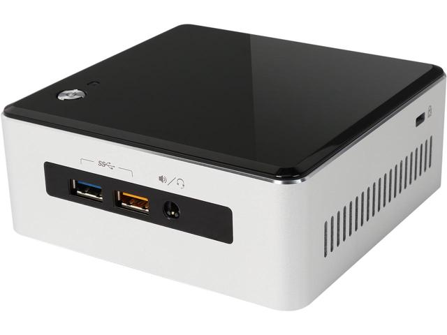

# Intel Industrial IoT Workshop Setup Guide
Welcome to the Intel Industrial IoT Workshop. In this workshop, we will explore Industry 4.0 technologies through lectures and hands on labs. By the end of the workshop, you should have a solid understanding of different Industry 4.0 technologies and have some working ideas of how to implement them in your place of business.

## Workshop Agenda
* **Introduction to Industrial Internet of Things**
  - Slide Deck - Introduction to Industrial Internet of Things
  - Video - [Industrial Applications](https://www.intel.com/content/www/us/en/industrial-automation/overview.html)

* **Formalizing the Industrial Internet of Things**
  - Slides - Formalizing the Industrial Internet of Things
  - Video - [A New Industrial Revolution through the Internet of Things](https://www.intel.com/content/www/us/en/industrial-automation/industrial-vision-video.html)
  - Lab - [Setup the Up2 Board Hardware](https://github.com/SSG-DRD-IOT/lab-up2-setup),
  - Lab - [Setup NUC Hardware](https://github.com/SSG-DRD-IOT/lab-nuci7-setup)

* **Software Defined Industrial Systems - Sensors**
  - Slides - Sensor and Actuators
  - Video - [Input and Output with MRAA](https://www.youtube.com/watch?v=hY4HudLuvEM)
  - Lab - [Sensors and Actuators](https://github.com/SSG-DRD-IOT/toc-sensors)

* **Software Defined Industrial Systems - Protocols**
  - Slides - Industrial Protocols
  - Lab - Publish sensor data over MQTT-TLS - Choose one: [C Language](https://github.com/SSG-DRD-IOT/lab-protocols-mqtt-c), Arduino Create
  - Lab - OPC-UA Server and Client -  Choose one: [C Language](https://github.com/SSG-DRD-IOT/lab-sensors-opc-ua)

* **Software Defined Industrial Systems - Automation**
  - Slides - Automation and the IIoT
  - Video - [Beckhoff Industrial Solutions](https://www.intel.com/content/www/us/en/industrial-automation/products-and-solutions/intel-beckhoff-industrial-solutions-video.html)
  - Lab - [Building an Automation Service](https://github.com/SSG-DRD-IOT/lab-iot-automation)

* **Security for IIoT**
  - Slides: Security for IIoT
  - Lab: [Security Concepts](https://github.com/SSG-DRD-IOT/lab-nuc-security)

* **Computer Vision**
  - Slides: Computer Vision
  - Demo: Movidius Lane Detection, OpenVX Lane Detection
  - Lab: [OpenCV Basics and Lane Detection Lab](https://github.com/SSG-DRD-IOT/lab-opencv-examples)

* **Feedback, Survey and Conclusion**

## Hardware Used in this Workshop
Intel offers scalable hardware solutions at different power, performance and price points. During these labs we will be using two different products that have Intel hardware.

**For the first part of this workshop, we will use the Up2 Board and connect to the Arduino Create online development tool. During the second part of this workshop, we will use the Intel NUC Core i7.**

### Up2 Board
First is the [Up2 Board](http://www.up-board.org/upsquared/). It features a 40 Pin I/O connector, multiple USB 3.0 ports, double Gigabit Ethernet, HDMI and more other features make it a perfect solution for different domains and products like Robotics, Drone, Machine Vision, Smart Home, Education, Digital Signage, Intelligent Cars, Internet Of Things. The compatibility with Linux, Android, and all the Windows 10 distributions give you great flexibility, scalability and quick time to market.

### NUC Core i7
 The second is a [NUC Core i7](https://www.intel.com/content/www/us/en/products/boards-kits/nuc/kits/nuc5i5ryh.html) with powerful performance in a small package. This NUC will be used to power machine learning, computer vision and large dataset jobs anywhere in your network.

