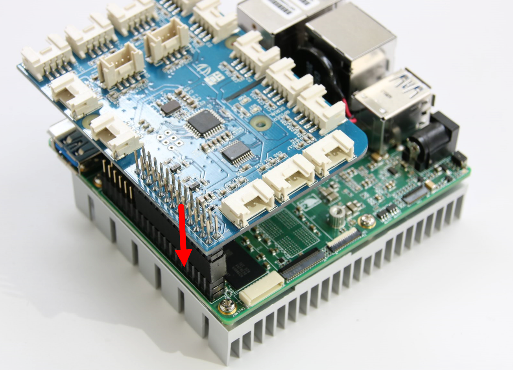

# Intel Industrial IoT Workshop Setup Guide
Welcome to the Intel Industrial IoT Workshop. In this workshop, we will explore Industry 4.0 technologies through lectures and hands on labs. By the end of the workshop, you should have a solid understanding of different Industry 4.0 technologies and have some working ideas of how to implement them in your place of business.

## How Do I Use the Lab Material

The links below will guide the workshop attendee through the slides, videos and labs in the Intel Industrial IoT Workshop.

The first lab, [Setup the Up2 Board Hardware](https://software.intel.com/en-us/upsquared-grove-getting-started-guide), is a preperatory lab to setup the hardware and software used in the rest of the labs, and to deploy a sample program to be sure that the attendee has correct understood the workflow to write, compile and deploy an application.

The sensor and protocol labs use the Up2 Board, the sensors from the hardware kit and the Arduino Create environment to prototype a sensor, use the MRAA and UPM libraries to create the interface between the sensor and the Up2 board and then explore several different network protocols common to the IIoT.

Next, we will spend some time talking about different types of automation and use a Juypter Notebook running Python to build a rules-based automation service.

Lastly, we will look at the smart video field, where software and hardware are merging to produce new intelligent video systems.

The Intel IoT Developer Relations team, hopes that you enjoy this IIoT Workshop.

## Social Media and Feedback

If you are posting on social media the hashtags for the event are ***IntelIoT*** and **CommercialIoT**.

Feel free to talk to any of the Intel people at this event to leave feedback.

Also if you find errors in the workshop material all of our labs are on Github. feel free to fork any repository and send us a pull request. Afterall, that's why we are on Github.

## Workshop Agenda
* **Introduction to Industrial Internet of Things**
  - Slide Deck - [Introduction to Industrial Internet of Things](https://github.com/SSG-DRD-IOT/Industrial-IoT-Workshop/blob/master/presentations/01-Introduction-to-the-Industrial-Internet-of-Things.pptx)
  - Video - [Industrial Applications](https://www.intel.com/content/www/us/en/industrial-automation/overview.html)
  - Video - [A New Industrial Revolution through the Internet of Things](https://www.intel.com/content/www/us/en/industrial-automation/industrial-vision-video.html)
  - Lab - [Setup the Up2 Board Hardware](https://github.com/SSG-DRD-IOT/lab-up2-setup),

* **Software Defined Industrial Systems - Sensors**
  - Slides - [Sensor and Actuators](https://github.com/SSG-DRD-IOT/Industrial-IoT-Workshop/blob/master/presentations/03-Sensors-and-Actuators.pptx)
  - Video - [Input and Output with MRAA](https://www.youtube.com/watch?v=hY4HudLuvEM)
  - Lab - [Sensors and Actuators](https://github.com/SSG-DRD-IOT/toc-sensors)

* **Software Defined Industrial Systems - Protocols**
  - Slides - [Industrial Protocols](https://github.com/SSG-DRD-IOT/Industrial-IoT-Workshop/blob/master/presentations/04-Industrial-Protocols.pptx)
  - Lab - [Publish sensor data over MQTT-TLS](https://github.com/SSG-DRD-IOT/lab-protocols-mqtt-arduino/)
  - Lab - [OPC-UA Server and Client](https://github.com/SSG-DRD-IOT/lab-sensors-opc-ua)
  - Lab - [Virtual Sensor](https://github.com/SSG-DRD-IOT/virtual-sensor)

* **Software Defined Industrial Systems - Automation**
  - Slides - [Automation and the IIoT](https://github.com/SSG-DRD-IOT/Industrial-IoT-Workshop/blob/master/presentations/05-Automation.pptx)
  - Video - [Beckhoff Industrial Solutions](https://www.intel.com/content/www/us/en/industrial-automation/products-and-solutions/intel-beckhoff-industrial-solutions-video.html)
  - Lab - Choose either lab [Building an Automation Service in Python](https://github.com/SSG-DRD-IOT/lab-automation-jupyter/) or [Building an Automation Service in JavaScript](https://github.com/SSG-DRD-IOT/lab-iot-automation)

* **Additional Information**
  - Lab - [Extra Infomration - Setup Alternative IDEs](https://github.com/SSG-DRD-IOT/doc-alternative-IDEs)

* **Computer Vision**
  - Slides: [Computer Vision](https://github.com/SSG-DRD-IOT/Industrial-IoT-Workshop/blob/master/presentations/07-Computer-Vision.pptx)
  - Video: [Introduction to the Movidious Neural Compute Stick](https://www.youtube.com/watch?v=VioTPaYcF98)
  - Video: [Mouser Product Brief on Movidious Neural Computer Stick](https://www.youtube.com/watch?v=gl_iKYr9EKk)
  - Demo: Movidius Lane Detection, OpenVX Lane Detection
  - Lab: [OpenCV Basics and Lane Detection Lab](https://github.com/SSG-DRD-IOT/lab-opencv-examples/)

* **Feedback, Survey and Conclusion**

## Hardware Used in this Workshop
Intel offers scalable hardware solutions at different power, performance and price points. During these labs we will be using two different products that have Intel hardware.

**For the first part of this workshop, we will use the Up2 Board and connect to the Arduino Create online development tool. During the second part of this workshop, we will use the Intel NUC Core i7.**

### Up2 Board
First is the [Up2 Board](http://www.up-board.org/upsquared/). It features a 40 Pin I/O connector, multiple USB 3.0 ports, double Gigabit Ethernet, HDMI and more other features make it a perfect solution for different domains and products like Robotics, Drone, Machine Vision, Smart Home, Education, Digital Signage, Intelligent Cars, Internet Of Things. The compatibility with Linux, Android, and all the Windows 10 distributions give you great flexibility, scalability and quick time to market.

