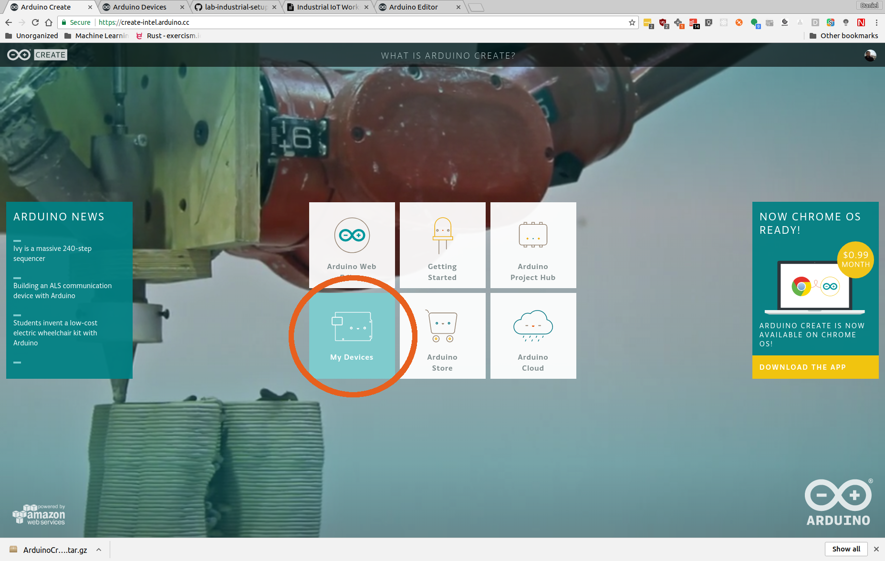
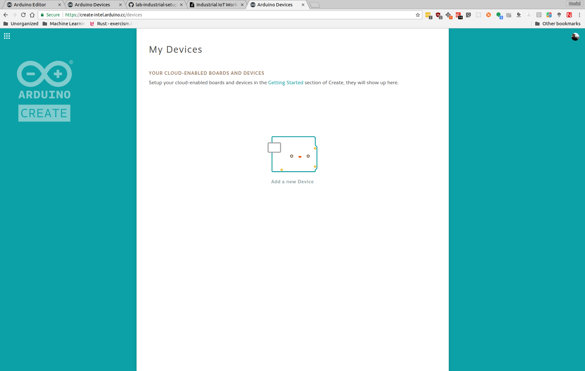
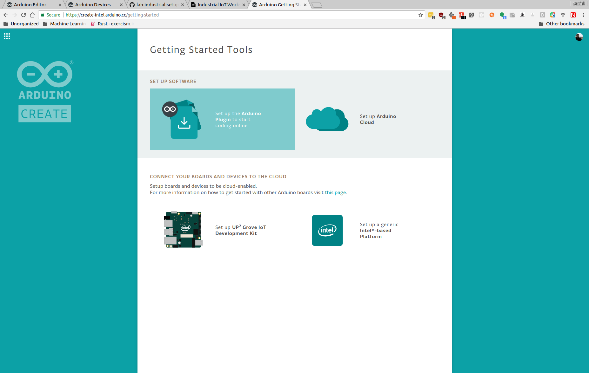
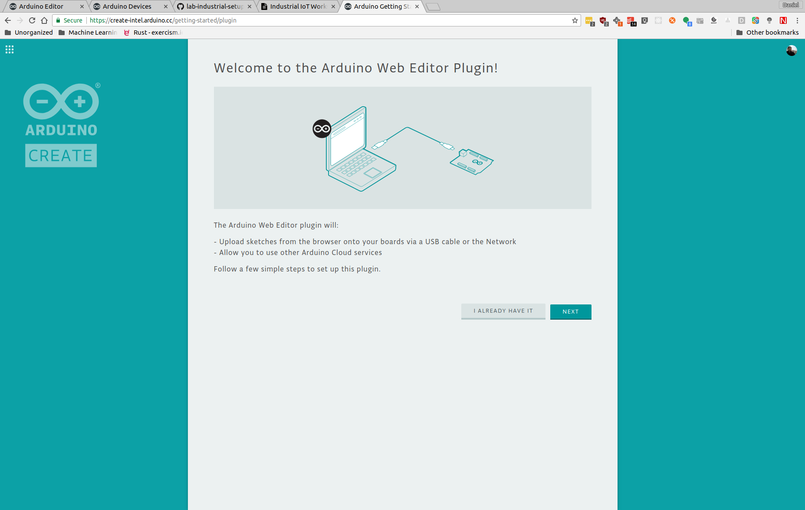

[Workshop Agenda](README.md) > [UP2 Getting Started Guide](up2-getting-started.md) > [Install the Arduino Create Agent](up2-setup)

# Installing the Arduino Create Agent

The Arduino Create Agent is a small service that connects your development computer to your prototyping board. Even though the development environment is a web application in the cloud, you still must have the prototyping board and your development computer on the same network.

## Installation Steps
To install the Arduino Create Agent, you must first go to [http://create.arduino.cc/](http://create.arduino.cc/) and click on the **My Devices** link.

 Click on **Add a new Device**.

 Select the **Next** button.

 Select the **Set up the Arduino Plugin to start coding online** link.

 If you don't already have the plugin then click next.

 The Arduino Create website will detect your OS and begin downloading the Os specific Arduino Create Agent.

Install the Agent and you will see if appear in the system tray of UI menu of your operating system.

## Connection over IP Networking
After you install the Arduino Create Agent, it will use the USB cable that you connected from the Up2 Board to your development computer to login to your Up2 Board, get the IP address and complete the registration process with the Arduino Create environment.

## Next Steps
