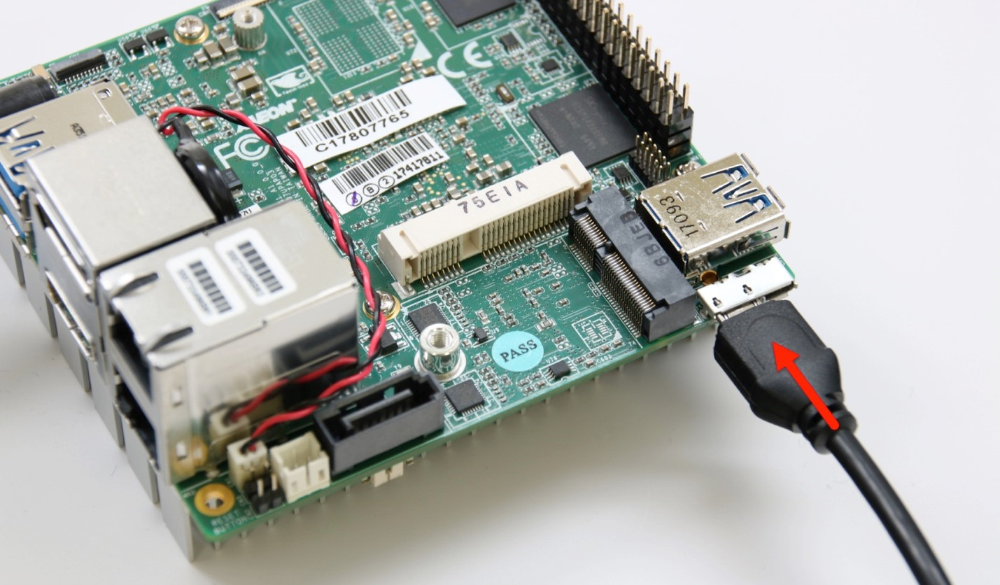

# UP2 Grove IoT Development Kit Getting Started Guide

## Before you begin
### Introduction
This guide will walk you through powering on your board and getting a first project going (to blink an LED). Let’s get going!

### Gather your materials
You’ll need the following:
*	UP2 board (included in kit)
*	Power cord (included in kit)
*	Micro USB cable (included in kit)
*	Grove Pi+ Board (included in kit)
*	Ethernet cable with network connection (not included in kit)

Nice to have but not required:
* Power strip to turn your board on and off, easier than unplugging the cable every time
* A terminal program (like puTTY) on your host computer for debugging via the serial COM port
* A screen, keyboard, and mouse, for debugging or just to see what’s going on in your board.

## First-time setup
Plug the micro USB cable into the UP2 board, and the other end into your host computer. The micro USB port is located near the lone USB 3.0 port.

## Installing the Grove Pi + Board
Line up pin 1 on the Grove board with the small arrow that indicates pin 1 on the UP2 Board.

Find a wired Ethernet internet connection and plug it into the port of your UP2 board. It doesn’t matter which Ethernet port on the board you choose.

### Powering on your board
Power on your UP2 board. You should see a blue LED light up near the power connector.
We’ll come back to using the hardware after setting up the Arduino Create development environment.

### Register and install Arduino Editor plugin
Log in to https://create-intel.arduino.cc/. If you don’t have an account, you can register at https://auth.arduino.cc/register.
Click on Getting Started or go to https://create-intel.arduino.cc/getting-started.
Select the UP2 Grove IoT Development Kit.

If this is your first time using Arduino Create you’ll be asked to install the Arduino plugin.

After you’ve installed the plugin, follow the on screen instructions.
If you get stuck at this step:

Try the following:
•	If you are on Windows, make sure there isn’t a pop-up asking you to install a driver.
•	If this step is taking longer than one or two minutes, then hard refresh the webpage.  If you’re on Chrome, in Windows it is Ctrl+Shift+R , on Mac hold Shift and click the Reload button, then try again.
