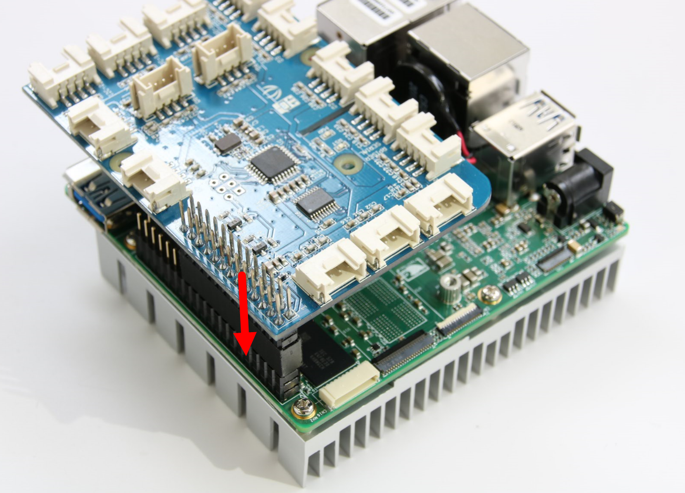

[Workshop Agenda](README.md) > [UP2 Getting Started Guide](up2-getting-started.md) > [Setup Hardware](up2-setup)

## First-time setup
Plug the micro USB cable into the UP2 board, and the other end into your host computer. The micro USB port is located near the lone USB 3.0 port.

## Installing the Grove Pi + Board
Line up pin 1 on the Grove board with the small arrow that indicates pin 1 on the UP2 Board.

Find a wired Ethernet internet connection and plug it into the port of your UP2 board. It doesn’t matter which Ethernet port on the board you choose.

### Powering on your board
Power on your UP2 board. You should see a blue LED light up near the power connector.
We’ll come back to using the hardware after setting up the Arduino Create development environment.
